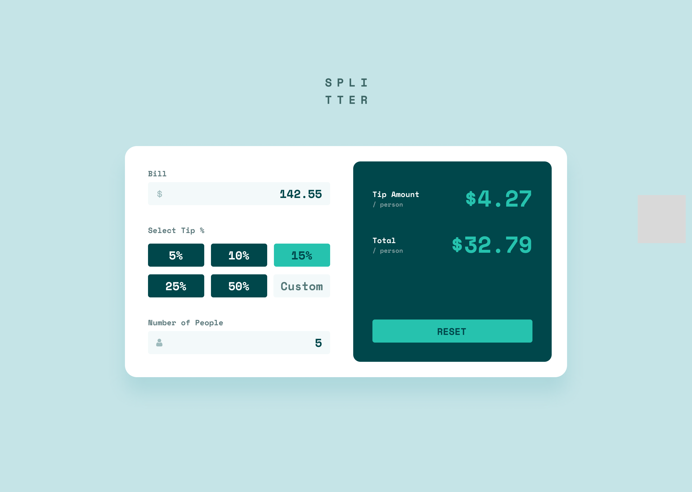

# TIP CALCULATOR

## Description:

That's my second JavaScript project. It helps people to calculate their tip. Making proces was not hard, but took the whole day.

## Features:

Tip Calculator calculates the amount of tip per person and total bill per person.

### Screenshot:

## How to use:

1. Type amount of bill
2. Pick tip amount, you can choose from buttons or use custom input
3. Type how many people are going to split the tip
   Done!

## Technologies:

- HTML5
- CSS3
- JavaScript

## Author:

[Linkedin:](https://www.linkedin.com/in/levan-gelashvili-669327227/)
